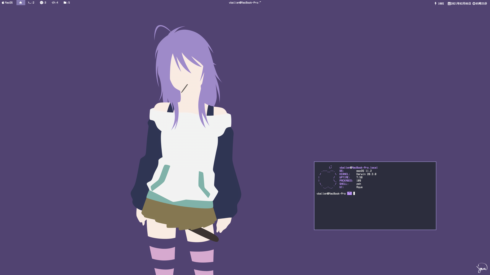

# vbalien's yabai status bar

## Install

```sh
$ git clone https://github.com/vbalien/vbalien-yabai-statusbar.git $HOME/Library/Application\ Support/Übersicht/widgets/vbalien
```

## Preview



## yabai 이벤트 등록 필수

```sh
yabai -m signal --add event=application_activated \
    action="osascript -e 'tell application \"Übersicht\" to refresh widget id \"vbalien-title-jsx\"'"

yabai -m signal --add event=window_title_changed \
    action="osascript -e 'tell application \"Übersicht\" to refresh widget id \"vbalien-title-jsx\"'"

yabai -m signal --add event=space_changed \
    action="osascript -e 'tell application \"Übersicht\" to refresh widget id \"vbalien-workspace-jsx\"'"
```
